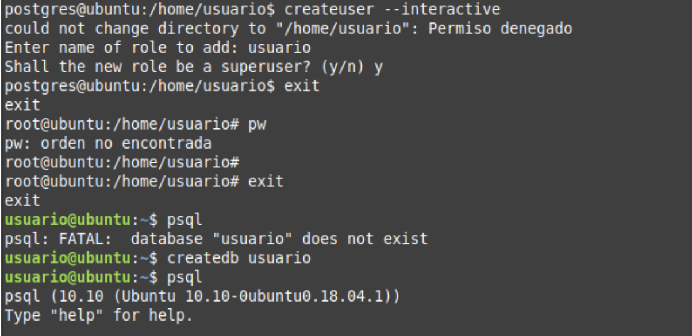
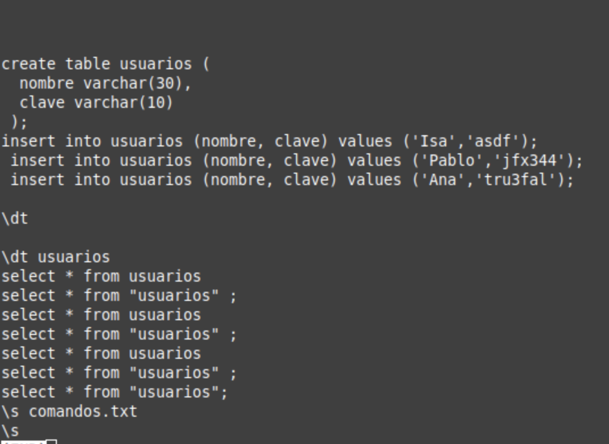

# Práctica 1: Presentación Supuesto Proyecto de Bases de Datos
## *Administración  y Diseño de Base de Datos*
### Akshay Chatani Chatani, Zuzanna Elzbieta Szalaty & Benjamin Paddags

#### Introducción
* El objetivo de esta práctica ha sido instalar postgresql y probarlo creando una base de datos de prueba.

#### Instalación postgresql
Para poder instalar el programa en nuestra máquina virtual es necesario ser el root. Por ello habrá que usar el siguiente comando:
sudo apt-get install postgresql

#### Creación de la Base de Datos 
* sudo su postgres: Cambiamos al usuario postgres ya que es el que tiene los permisos para acceder a la base de datos de postgres
* createuser --interactive: Este comando sirve para crear un usuario de modo interactivo ( para que nos vaya preguntando los detalles por terminal).
* createdb usuario: Este comando sirve para crear una base de datos llamada usuario.
* psql: Con este comando entramos en la interfaz de programación de postgresql.

#### Creación de un ejemplo de pruebas
En la shell psql como el nuevo usuario “usuario”, se ejecutó:
alter role miusuario with password 'mipassword';
create table usuarios (
nombre varchar(30) ,
clave varchar(10)
) ;
Esto creará una tabla llamada usuarios que contiene un campo para el nombre y otro para la clave
insert into usuarios (nombre, clave) values ('Isa', 'asdf’);
insert into usuarios (nombre, clave) values (‘Pablo', 'jfx344');
insert into usuarios (nombre, clave) values ('Ana', 'tru3fal');
Se inserta dentro de la tabla usuarios los campos nombre y clave con los valores que queremos.

