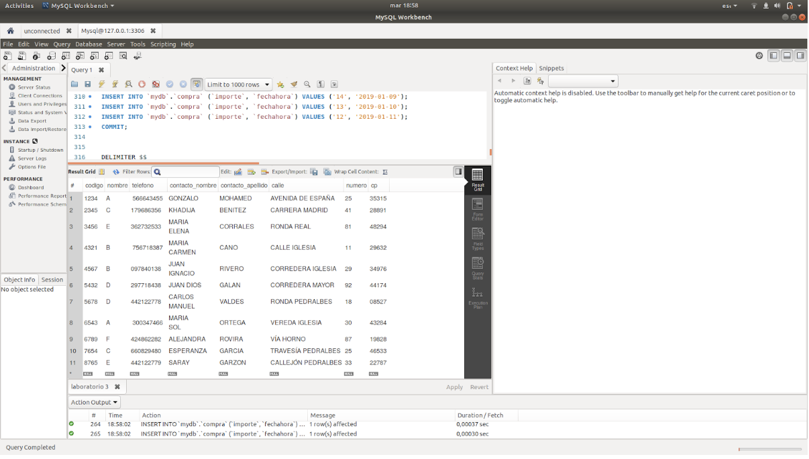
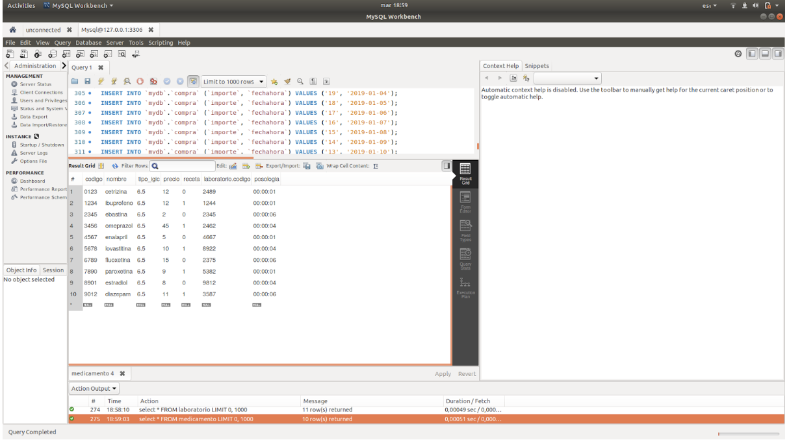
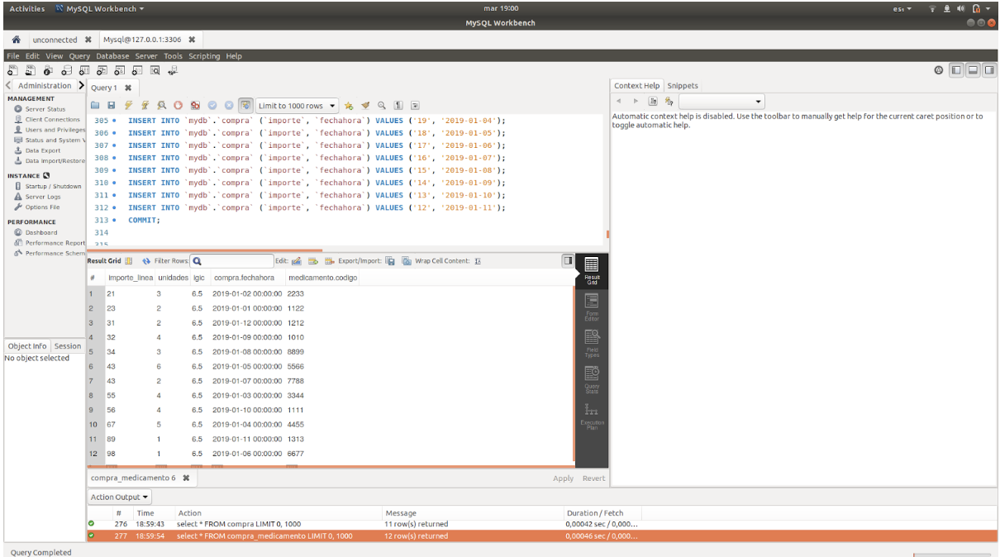
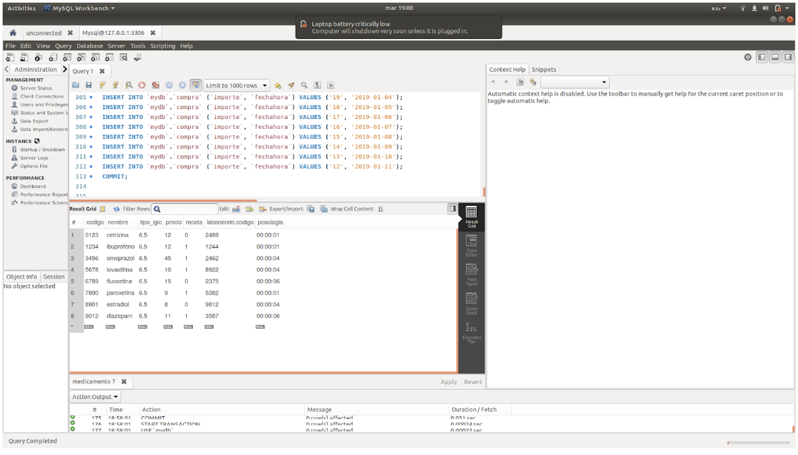
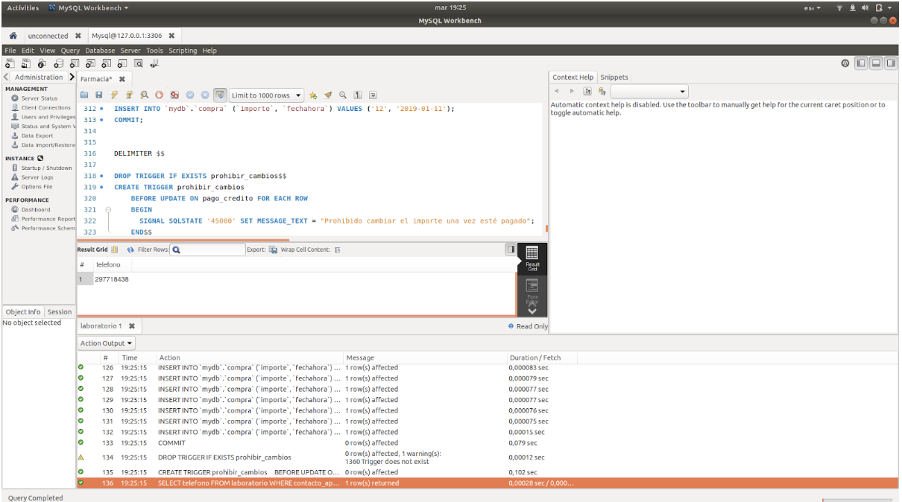
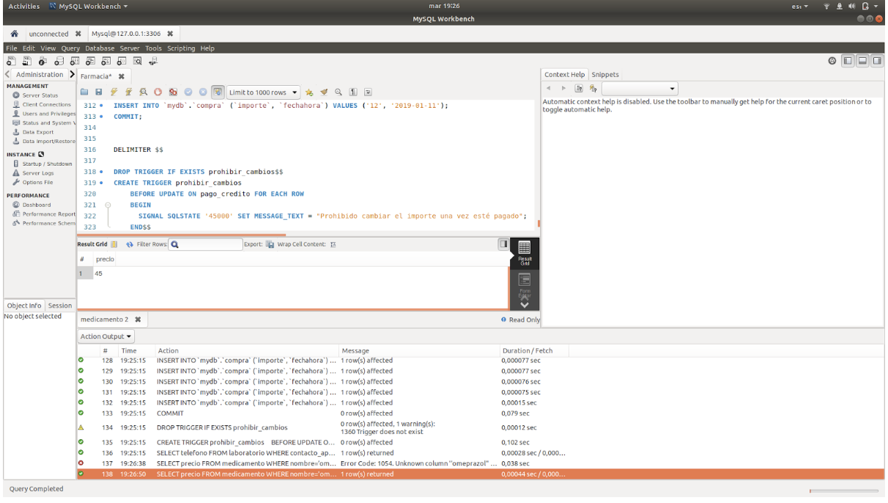

# Práctica 9:Diseño e implementación: Farmacias
## Administración  y Diseño de Base de Datos

### Akshay Chatani Chatani, Zuzanna Elzbieta Szalaty & Benjamin Paddags

A continuación se muestran algunas consultas realizadas:

* SELECT * FROM laboratorio:

* SELECT * FROM medicamento :

* SELECT * FROM compra_medicamento:

* SELECT * FROM medicamento WHERE precio>5:

* SELECT telefono FROM laboratorio WHERE contacto_apellido='GALAN';

* SELECT precio FROM medicamento WHERE nombre=’omeprazol’;

